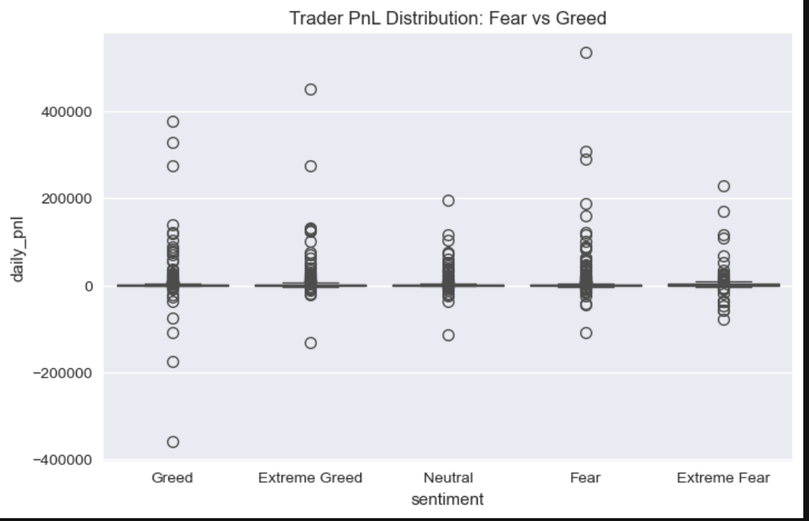
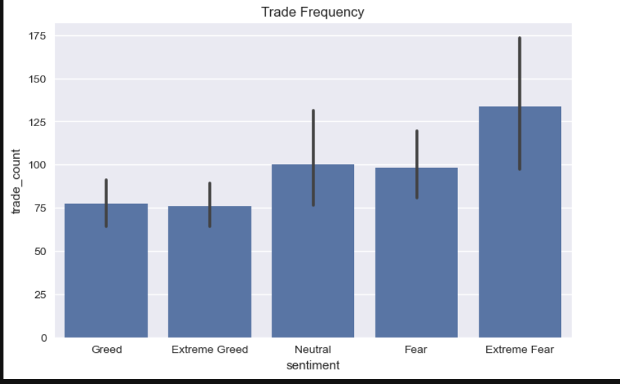
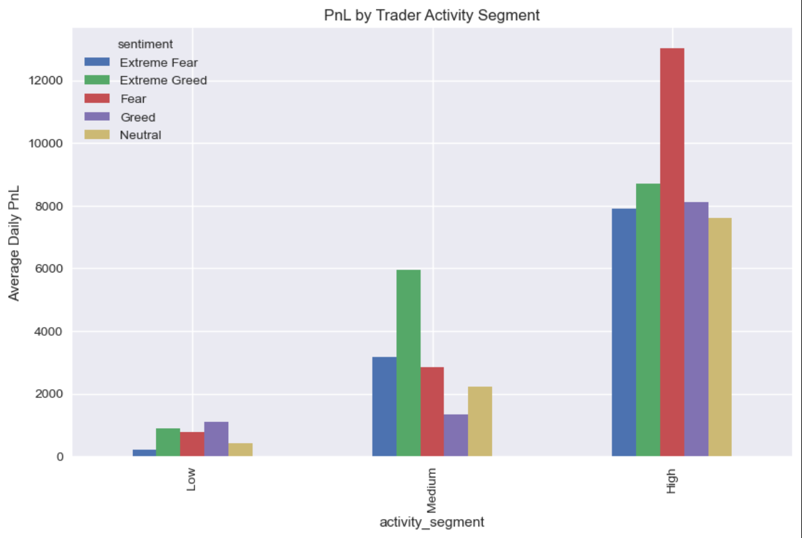
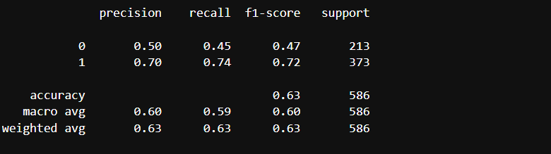

# Trader Performance vs Market Sentiment Analysis

## Objective
Analyze how Bitcoin market sentiment (Fear/Greed) impacts trader behavior and profitability using historical Hyperliquid trading data.

---

## Project Overview
This project explores how trader performance and behavior vary across different market sentiment regimes (Extreme Fear → Extreme Greed).  
We analyze daily trader PnL, trade frequency, behavioral segmentation, and also build a predictive ML model to forecast profitability.

---

## Dataset Description

### 1. Bitcoin Fear & Greed Index
- Columns: Date, Classification (Extreme Fear, Fear, Neutral, Greed, Extreme Greed)

### 2. Historical Trader Data (Hyperliquid)
- Key Columns:
  - account
  - symbol
  - execution_price
  - size
  - side
  - time
  - closedPnL

---

## Methodology
1. Data Cleaning & Preprocessing  
   - Converted timestamps  
   - Removed null & inconsistent records  
   - Aligned both datasets on daily level  

2. Feature Engineering  
   - Daily PnL per trader  
   - Trade frequency  
   - Average trade size  
   - Long/Short bias  

3. Analysis  
   - Sentiment-wise comparison  
   - Trader segmentation  
   - Behavioral insights  

4. Bonus  
   - Machine Learning model to predict daily profitability  

---

## Key Visual Insights

### 1. Trader PnL Distribution — Fear vs Greed

**Insight:**  
- Greed and Extreme Greed days show higher upside potential.  
- Fear regimes have higher downside risk and volatility.

---

### 2. Trade Frequency by Sentiment

**Insight:**  
- Traders trade significantly **more during Extreme Fear and Neutral markets**.  
- Suggests panic-driven overtrading during high uncertainty.

---

### 3. PnL by Trader Activity Segment

**Insight:**  
- High activity traders consistently outperform across all sentiment regimes.  
- However, they also face larger drawdowns during Fear periods.

---

## Key Findings

1. **Greed sentiment is associated with higher profitability but also higher risk.**
2. **Fear sentiment leads to reduced risk-taking and lower profitability.**
3. **High-frequency traders outperform but face extreme volatility.**
4. Trade frequency and position sizing strongly influence performance.

---

## Strategy Recommendations

### 1. Fear Regime Strategy
- Reduce trade frequency  
- Lower position sizes  
- Trade selectively  

### 2. Greed Regime Strategy
- Moderate increase in trade frequency  
- Apply strict risk management  
- Focus on trend-following setups  

---

## Bonus — Machine Learning Model

We trained a **Random Forest Classifier** to predict daily trader profitability.

### Model Performance

